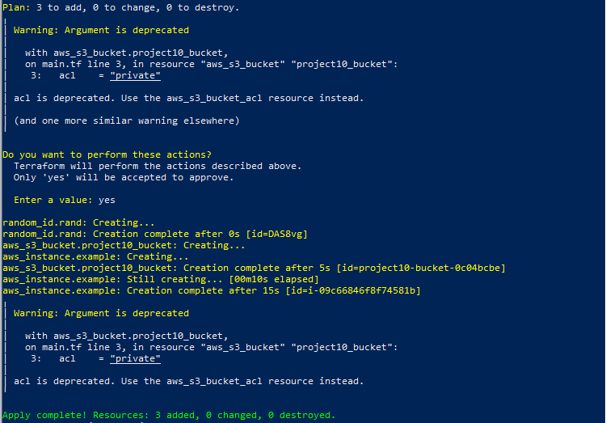
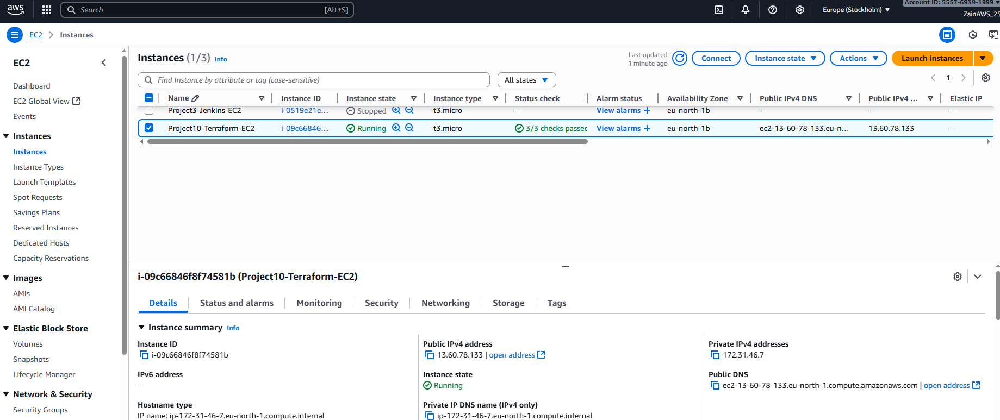

# 🏗️ Project 10: AWS IaC with Terraform  
### Automated ☁️ EC2 • 🔒 S3 • 📈 Monitoring

**Author:** [Taimoor DevOps](https://github.com/taimoordevops)  
**Date:** September 2025  

---

## 🚀 Project Overview

It highlights:  
- 🚀 **Compute**: EC2 instance creation (t3.micro, free-tier)  
- 📦 **Storage**: S3 bucket provisioning with random ID for uniqueness  
- 📊 **Monitoring**: Simple CloudWatch CPU utilization alarm  
- 🔀 **Workspaces**: Environment-specific configuration  
- 💾 **Version control**: Terraform code tracked on GitHub  

This showcases my ability to **automate cloud infrastructure, ensure reproducibility, and integrate monitoring** — all core DevOps & Cloud Engineering skills.

---

## 🛠️ Tech Stack

- **Terraform v1.13.1**  
- **AWS**: EC2, S3, CloudWatch  
- **PowerShell** (Windows 10)  
- **Git & GitHub** for version control  

---

## 📦 Repo Structure

Project10-Terraform-AWS/
```
│
├─ .gitignore # ignores .terraform/, tfstate files
├─ provider.tf # AWS provider configuration
├─ main.tf # main Terraform resources (random_id, S3)
├─ ec2.tf # EC2 instance configuration
├─ cloudwatch.tf # CloudWatch alarm configuration
├─ screenshots/ # screenshots showing apply, plan, state, CloudWatch
└─ README.md # this file
> **Note:** Full `terraform.tfstate` is excluded from GitHub for security. Screenshots provide evidence of resource tracking.
```
## ⚡ Key Features

### 1. EC2 Instance
- **AMI**: Ubuntu 22.04 (eu-north-1)  
- **Type**: t3.micro (free-tier)  
- **Name tag**: Project10-Terraform-EC2  
- Shows ability to provision **compute resources** via IaC.

### 2. S3 Bucket
- Automatically created via Terraform  
- Configured as **private**  
- Demonstrates **storage automation** and **resource tracking**.

### 3. CloudWatch Alarm
- Monitors **CPUUtilization > 80%**  
- Simple monitoring setup to demonstrate **observability**  

### 4. Random ID Resource
- Generates unique identifier for bucket naming  
- Ensures **resource uniqueness** across environments  

---

## 📸 Screenshots

Included in `screenshots/` folder:


1. **Terraform plan** → shows resources to be added  
2. **Terraform apply confirmation & output** → resources created  
3. **Terraform destroy confirmation & output** → resources destroyed, cleanup proof  
4. **Terraform state screenshot** → shows EC2 & S3 tracked by Terraform  
5. **AWS console** → EC2 running & S3 bucket created  
6. **CloudWatch alarm** → CPU utilization alarm

## 📸 Demo Screenshots  

Terraform apply in action:  
  

AWS Console showing EC2 instance:  


## 🔧 How to Run (Optional)

1. Clone the repository:  
```bash
git clone https://github.com/taimoordevops/project10-terraform-aws-taimoordevops.git
```
2. Initialize Terraform:
```
terraform init
```

3. Apply infrastructure:
```
terraform apply
```
> *Type 'yes' when prompted...*


4. Destroy infrastructure after testing (to avoid AWS charges):
```
terraform destroy
```
> *Type 'yes' when prompted...*
